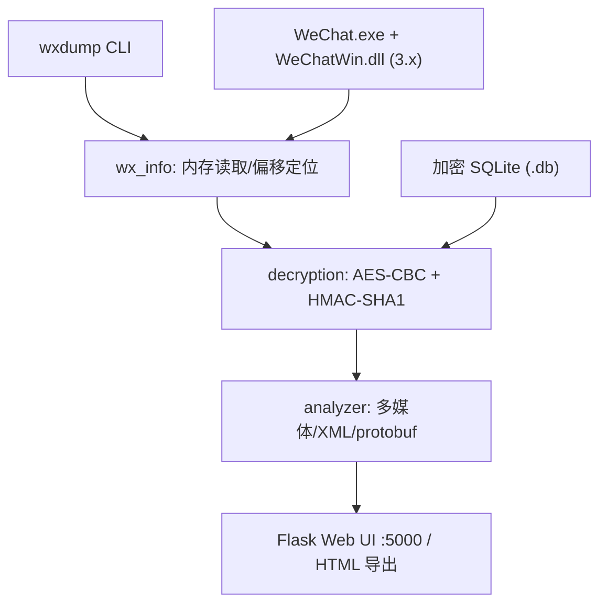
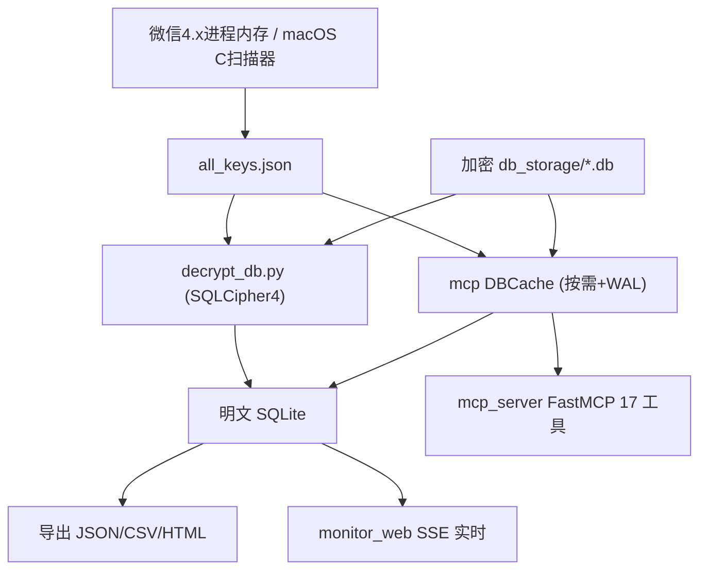

# 微信聊天记录解析项目分析报告

> 分析对象：
> - **PyWxDump**：`/path/to/PyWxDump/`（v2.3.21）
> - **wechat-decrypt**：`/path/to/wechat-decrypt/`
>
> 报告目的：详细分析两个用于解析微信聊天记录的开源/自研项目的功能与结构，并进行系统性对比，为后续的「微信历史数据治理」工作提供技术选型与集成依据。

---

## 目录

1. [概述与核心结论](#1-概述与核心结论)
2. [PyWxDump 项目分析](#2-pywxdump-项目分析)
3. [wechat-decrypt 项目分析](#3-wechat-decrypt-项目分析)
4. [横向对比分析](#4-横向对比分析)
5. [关键技术原理对比](#5-关键技术原理对比)
6. [选型建议与治理结合点](#6-选型建议与治理结合点)
7. [安全与合规提示](#7-安全与合规提示)

---

## 1. 概述与核心结论

两个项目目标一致——**从本地微信客户端中获取数据库密钥、解密 SQLite 数据库、解析并导出聊天记录**——但面向的微信版本、运行平台、消费方式与工程定位存在本质差异。

| 维度 | PyWxDump | wechat-decrypt |
|------|----------|----------------|
| 定位 | 成熟的开源取证/备份工具，社区维护 | 自研 AI 友好型工具，面向「AI 查询 + 实时监听」 |
| 目标微信版本 | **PC 微信 3.x**（`WeChatWin.dll`） | **微信 4.x**（WCDB / `Weixin.exe`）+ 企业微信 5.x（实验） |
| 加密体系 | SQLCipher 风格，AES-256-CBC + **HMAC-SHA1**，PBKDF2 **64000** 次 | SQLCipher 4，AES-256-CBC + **HMAC-SHA512**，reserve=80 |
| 运行平台 | **仅 Windows** | **Windows / macOS / Linux** 跨平台 |
| 主消费方式 | Flask Web 查看器 + HTML 导出 | **MCP Server（AI 查询）** + Web UI（SSE 实时） + 多格式导出 |
| 工程规模 | 多包模块化，代码量中等 | 单层脚本众多，`mcp_server.py` 单文件约 4039 行 |
| 突出特性 | 内存偏移自动定位（`bias`）、49 版本偏移库 | 17 个 MCP 工具、实时 WAL 监听、语音转录、跨平台密钥扫描 |

**一句话总结**：
- **PyWxDump** 是面向 **微信 3.x** 的、经过沉淀的取证工具，强项在「内存偏移自动定位 + Web 浏览」。
- **wechat-decrypt** 是面向 **微信 4.x** 的、AI 时代的工具，强项在「MCP 接入大模型 + 实时监听 + 跨平台 + 富媒体解析」。

> 两者并非简单的新旧替代关系——它们针对的是**不同代际的微信加密体系**（3.x vs 4.x），因此在数据治理中可能需要**同时保留**以覆盖不同版本的历史数据。

---

## 2. PyWxDump 项目分析

### 2.1 项目结构

```
PyWxDump-master/
├── setup.py                     # 打包配置、入口点 wxdump、依赖
├── requirements.txt
├── pywxdump/                    # 主包
│   ├── __init__.py              # 公共 API 聚合导出
│   ├── cli.py                   # CLI 主入口（console_run）
│   ├── version_list.json        # 49 个微信版本的内存偏移表
│   ├── wx_info/                 # 微信信息获取、解密、合并
│   │   ├── get_wx_info.py       # 读内存获取账号/密钥/wxid/路径
│   │   ├── get_bias_addr.py     # 自动计算版本内存偏移（替代 Cheat Engine）
│   │   ├── decryption.py        # SQLite 页级 AES 加解密
│   │   ├── merge_db.py          # MSG/MediaMSG 分片合并
│   │   └── simplify_wx_info.py  # 极简版：仅 wxid/key/路径
│   ├── analyzer/                # 数据库内容解析
│   │   ├── db_parsing.py        # 图片/语音/XML/lz4/protobuf 解析
│   │   ├── export_chat.py       # 导出/HTML 渲染（多库 ATTACH）
│   │   ├── chat_analysis.py     # 统计/词云/折线图（未接入 CLI）
│   │   └── utils.py             # SQLite ATTACH 工具
│   ├── ui/                      # Flask Web 查看器
│   │   ├── view_chat.py         # Blueprint + 路由
│   │   └── templates/           # index.html / chat.html
│   └── api/                     # 空占位包（无实现）
├── doc/                         # 文档（UserGuide/FAQ/数据库简述/CE获取基址 等）
└── tests/                       # 测试 + build_exe.py（PyInstaller）
```

### 2.2 核心功能

| 功能 | 状态 | 说明 |
|------|------|------|
| 获取微信账号信息 | ✅ | 昵称/账号/手机/邮箱/wxid/版本/PID（3.7+ 邮箱常失效） |
| 获取数据库密钥 | ✅ | 需微信**已登录**进程运行 |
| 获取数据库路径 | ✅ | 自动发现 `WeChat Files/wxid_xxx/` 下各 `.db` |
| 微信多开支持 | ✅ | 遍历所有 `WeChat.exe` 进程 |
| 解密 SQLite | ✅ | 批量解密目录/文件，输出前缀 `de_` |
| 合并分片库 | ✅（测试） | `MSG0~5`、`MediaMSG0~5` 合并 |
| Web 查看聊天 | ✅ | Flask，`0.0.0.0:5000`，支持局域网 |
| 导出 HTML | ✅ | 按联系人分页生成静态 HTML |
| 导出 CSV/JSON | ❌ | 无 |
| 聊天统计/词云 | ⚠️ | `chat_analysis.py` 有代码但未接入 CLI |
| REST API | ⚠️ | 仅 `tests/flassk_demo.py` 演示 |

### 2.3 密钥获取原理

仅限 **Windows**，依赖 `psutil`（枚举进程）、`pymem`（pattern scan）、`ReadProcessMemory`（读内存）、`pywin32`（版本号）、`winreg`（文件路径）。

- v2.3.1 后**不再依赖固定 key 偏移**：在 `WeChatWin.dll` 内搜索设备类型字符串（iphone/android/ipad），向前回溯候选 32 字节 key；
- **密钥验证**：用候选 key 对 `MicroMsg.db` 首页做 PBKDF2-HMAC 校验，匹配即确认。
- `version_list.json` 偏移格式：`[昵称, 账号, 手机, 邮箱, KEY]`（相对 `WeChatWin.dll` 基址）。
- `wxdump bias` 子命令可自动计算并写回偏移，替代手工 Cheat Engine。

### 2.4 解密原理（SQLCipher 风格，纯 Python 实现）

`pywxdump/wx_info/decryption.py` 顶部注释完整描述了算法：

| 参数 | 值 |
|------|-----|
| 页大小 | 4096 字节，逐页加解密 |
| 盐 | 文件前 16 字节 |
| 解密 KDF | PBKDF2-HMAC-**SHA1**，**64000** 次迭代，32 字节 key |
| MAC key | `salt XOR 0x3a` 再 PBKDF2 **2** 次 |
| 完整性 | HMAC-**SHA1**（安卓为 SHA512） |
| 加密 | AES-256-CBC，IV 在每页末尾 48 字节保留区 |
| 输出 | 标准 `SQLite format 3\x00` 明文库 |

### 2.5 数据库结构

核心参考 `doc/wx数据库简述.md`：

| 数据库 | 核心表 | 用途 |
|--------|--------|------|
| `MSG.db` / `MSG0~5` | `MSG`, `Name2ID` | 聊天记录主体 |
| `MicroMsg.db` | `Contact`, `ChatRoom`, `Session` | 联系人/群/会话 |
| `MediaMSG.db` / `MediaMsg0~5` | `Media` | 语音 SILK 数据 |
| `FTSMSG` | FTS 索引 | 搜索 |

`MSG` 表关键字段：`StrTalker`（会话对象）、`IsSender`、`Type`/`SubType`、`StrContent`、`CompressContent`（lz4）、`BytesExtra`（protobuf，含群发言人）、`CreateTime`、`MsgSvrID`。

### 2.6 解析与导出

- 图片 `.dat`：单字节 XOR 解密 + 文件头识别；
- 语音：`MediaMSG.Media.Buf` → `pysilk` 解码 → WAV base64；
- XML 消息：`lxml`；CompressContent：`lz4.block`；BytesExtra：`blackboxprotobuf`；表情：`requests` 下载 CDN；
- Web 查看（`view_chat.py`）：联系人列表、分页聊天记录、HTML 导出，Jinja2 + Bootstrap4 模板。

### 2.7 CLI（`wxdump`）

| 子命令 | 功能 |
|--------|------|
| `bias` | 获取/更新版本内存偏移 |
| `info` | 获取微信信息（含 key） |
| `db_path` | 获取数据库路径 |
| `decrypt` | 解密数据库 |
| `merge` | 合并分片数据库 |
| `dbshow` | 启动 Flask Web 查看器 |
| `export` | 导出 HTML |
| `all` | 一键：info → decrypt → dbshow |

### 2.8 依赖项

`psutil`、`pycryptodomex`、`pywin32`、`pymem`、`silk-python`、`pyaudio`、`requests`、`pillow`、`flask`、`lz4`、`blackboxprotobuf`、`lxml`。

### 2.9 平台与版本支持

- **平台**：仅 Windows（硬依赖 Windows API），macOS/Linux 不可用。
- **微信版本**：PC 微信 **3.x**（约 `3.2.1.154` ~ `3.9.8.15`，收录 49 个版本），**无 v4 支持**；新版本需 `bias` 手动贡献偏移。

### 2.10 已知局限

1. 仅支持微信 3.x，不支持 v4 新架构；
2. 强依赖 Windows 内存读取，需微信进程运行且已登录；
3. 导出格式仅 HTML，无 CSV/JSON CLI；
4. `chat_analysis`、词云有代码但未产品化，`api` 包为空；
5. 版本维护依赖社区贡献偏移表。

---

## 3. wechat-decrypt 项目分析

### 3.1 项目结构

```
wechat-decrypt/
├── 入口/一键脚本
│   ├── main.py                    # CLI 总入口
│   ├── monitor_web.py             # Web UI + 实时监听（SSE，约 3000+ 行）
│   ├── app_gui.py                 # tkinter 桌面 GUI
│   ├── wechat_decrypt_launcher.py # PyInstaller exe 启动器
│   └── setup.sh / setup.py / cleanup.py / Makefile / build.bat
├── 密钥提取
│   ├── find_all_keys.py           # 平台分发 + 图片密钥离线爆破
│   ├── find_all_keys_windows.py   # Windows 内存扫描
│   ├── find_all_keys_linux.py     # Linux /proc 内存扫描
│   ├── find_all_keys_macos.c      # macOS Mach VM API（C）
│   ├── find_image_key*.py         # 图片 AES key
│   ├── find_wxwork_keys.py        # 企业微信 5.x
│   ├── key_scan_common.py         # 共享扫描/验证算法
│   └── key_utils.py
├── 解密
│   ├── decrypt_db.py              # 个人微信 SQLCipher 4
│   ├── decrypt_wxwork_db.py       # 企业微信 wxSQLite3
│   ├── wxwork_crypto.py           # 企微 per-page AES-128-CBC
│   ├── decode_image.py            # .dat 图片 V1/V2/XOR/wxgf
│   ├── decrypt_sns.py             # 朋友圈缓存图片
│   └── batch_decrypt_images.py
├── 导出
│   ├── export_all_chats.py        # 批量 JSON 导出（增量/delta）
│   ├── export_chat.py             # 单会话导出（import mcp_server）
│   ├── chat_export_helpers.py
│   ├── export_messages.py         # CSV/HTML/JSON
│   ├── export_wxwork_messages.py
│   └── export_sns.py
├── 服务/监听
│   ├── monitor.py                 # 命令行实时监听
│   ├── mcp_server.py              # MCP Server（约 4039 行，17 个工具）
│   └── decode_transfer.py
├── 语音
│   ├── transcribe_chat.py         # Whisper 三后端转录
│   └── voice_to_mp3.py            # SILK → MP3
├── 配置/打包/文档
│   ├── config.py / config.json
│   ├── requirements.txt / WeChatDecrypt.spec
│   └── README.md / USAGE.md / docs/
├── tests/                         # 21 个测试文件，约 336 个 test 函数
├── exported_chats/                # 导出产物（JSON）
├── decrypted/ / decoded_images/   # 运行时生成
```

### 3.2 核心功能

| 能力 | 说明 |
|------|------|
| 获取数据库密钥 | 从运行中微信进程内存扫描 WCDB 缓存的 raw key（三平台） |
| 解密 SQLite | SQLCipher 4 全库解密，支持增量 |
| **实时消息监听** | Web UI（SSE）/ CLI，30ms 轮询 WAL mtime |
| 批量导出聊天 | JSON/CSV/HTML，增量、日期范围、delta |
| 图片解密 | 旧 XOR / V1 / V2 / wxgf |
| 语音处理 | SILK→WAV→文本（local Whisper / OpenAI / whisper.cpp） |
| 朋友圈 | SnsTimeLine 解析 + 缓存图解密 |
| 企业微信（实验） | wxSQLite3 AES-128 解密与导出 |
| **MCP Server** | 供 Claude 等 AI 客户端查询微信数据（17 个工具） |
| GUI | Web UI（推荐）+ tkinter |
| 打包 exe | PyInstaller 单文件 |

### 3.3 密钥获取原理

微信 4.x 的 WCDB 在进程内存中缓存每个数据库的派生密钥，格式 `x'<64hex_enc_key><32hex_salt>'`：

- 每个 `.db` 文件 page 1 前 16 字节为 salt；
- 扫描内存匹配该 hex 模式，用 **HMAC-SHA512 校验 page 1** 确认密钥；
- 保存到 `all_keys.json`：`{ "message/message_0.db": { "enc_key", "salt", "size_mb" }, "_db_dir": "..." }`。

| 平台 | 方式 | 进程名 | 权限 |
|------|------|--------|------|
| Windows | `ReadProcessMemory` 扫描 | `Weixin.exe` | 管理员 |
| Linux | 读 `/proc/<pid>/mem` | `wechat` | root / `CAP_SYS_PTRACE` |
| macOS | C 程序（Mach VM API） | `WeChat` | root + ad-hoc 重签名 |

`config.py` 负责自动检测 `db_dir`（Windows 读 `%APPDATA%\Tencent\xwechat\config\*.ini`；macOS/Linux 搜索 `xwechat_files/*/db_storage`），多账号可交互选择。

### 3.4 解密原理（SQLCipher 4）

| 参数 | 值 |
|------|-----|
| 算法 | AES-256-CBC |
| 完整性 | HMAC-**SHA512** |
| KDF | PBKDF2-HMAC-SHA512（用户口令侧 256000 次，微信侧已派生 enc_key） |
| page_size | 4096 |
| reserve | 80（IV 16 + HMAC 64） |
| usable_size | 4016 |
| MAC key | `salt XOR 0x3a`，PBKDF2 2 轮 |

流程：取 `enc_key` → 读 page 1 提 salt → 派生 mac_key → 校验 HMAC → 逐页 `decrypt_page()`（page 1 保留标准 SQLite 头）→ `sqlite3.connect` 验证。

**WAL 处理**（MCP / 实时监听特有）：`DBCache` 按需解密到 `%TEMP%/wechat_mcp_cache/<hash>.db`，检测源 `.db` 与 `-wal` 的 mtime 变化重解密；`decrypt_wal()` 按 frame salt 只 patch 当前 WAL 周期的 frame。

### 3.5 数据库结构

解密后约 26 个数据库：

| 路径 | 用途 | 关键表/字段 |
|------|------|-------------|
| `session/session.db` | 会话列表 | `SessionTable`（username, unread_count, summary, last_timestamp） |
| `message/message_N.db` | 聊天记录（约 100MB/片） | 每用户一张表 `Msg_<md5(username)>` |
| `contact/contact.db` | 联系人 | `contact`（username, nick_name, remark）、`contact_label` |
| `media_N/media_N.db` | 语音等媒体 | `Name2Id`, `VoiceInfo`（SILK） |

消息字段：`local_id`, `local_type`, `create_time`, `real_sender_id`, `message_content`, `WCDB_CT_message_content`。
- `WCDB_CT_message_content == 4` 时内容为 **zstd 压缩**；
- `local_type` 低 32 位为 base type，高 32 位为 app 子类型；
- 类型映射：1 文本 / 3 图片 / 34 语音 / 43 视频 / 47 表情 / 48 位置 / 49 链接·文件 / 10000 系统 / 10002 撤回；`type=49` 子类含 6 文件、19 合并转发、57 引用、2000 转账等。

### 3.6 MCP Server 详解（核心亮点）

- **框架**：官方 Python `mcp` 包的 **FastMCP**，stdio 传输，`mcp.run()`；
- **注册**：`claude mcp add wechat -- python /path/to/mcp_server.py`；
- **自包含**：内置解密 + `DBCache` + 联系人缓存 + 富媒体解析，**不依赖**预先全量解密。

**暴露的 17 个 MCP 工具：**

| # | 工具 | 功能 |
|---|------|------|
| 1 | `get_recent_sessions` | 最近会话列表 |
| 2 | `get_chat_history` | 指定聊天记录（分页/时间/类型过滤） |
| 3 | `search_messages` | 全库/指定会话关键词搜索 |
| 4 | `get_contacts` | 搜索/列出联系人 |
| 5 | `get_contact_tags` | 列出所有标签及人数 |
| 6 | `get_tag_members` | 指定标签下成员 |
| 7 | `get_new_messages` | 自上次调用以来的新消息 |
| 8 | `decode_image` | 解密聊天图片为本地文件 |
| 9 | `decode_file_message` | 定位文件消息（PDF/docx）本地路径 |
| 10 | `decode_record_item` | 合并转发记录中某项的本地文件 |
| 11 | `decode_transfer` | 解析转账消息（type=2000） |
| 12 | `decode_refer` | 解析引用回复（type=57） |
| 13 | `decode_location` | 解析位置消息（base_type=48） |
| 14 | `get_chat_images` | 列出聊天图片消息（跨分片） |
| 15 | `get_voice_messages` | 列出语音消息 |
| 16 | `decode_voice` | SILK → WAV |
| 17 | `transcribe_voice` | 语音转文字（Whisper 三后端 + 缓存） |

内部子系统：`DBCache`（临时缓存解密 DB）、联系人缓存、标签系统（`contact_label` + protobuf）、跨分片分页搜索、路径遍历防护、XXE 防护、语音转录缓存。

### 3.7 `config.json` 配置项

`db_dir`、`keys_file`、`decrypted_dir`、`decoded_image_dir`、`wechat_process`、企业微信相关（`wxwork_*`）、`transcription_backend`/`local_whisper_model`/`openai_api_key`、自动推导项（`wechat_base_dir`、`output_base_dir`、`xwechat_attach_dir` 等）、图片密钥（`image_aes_key`/`image_xor_key`）。

### 3.8 依赖项

`requirements.txt`：`pycryptodome`、`zstandard`、`mcp`、`pilk`、`pyinstaller`。
按需：`silk-python`（pysilk）、`openai-whisper`、`openai`、`whisper-cpp` + `ffmpeg`。

### 3.9 CLI 与运行方式

`python main.py [decrypt|decode-images|export|all|status]`；独立脚本 `export_chat.py`、`transcribe_chat.py`、`decode_transfer.py`、`cleanup.py`；`make all`（macOS）。
Web UI（`monitor_web.py` → `http://localhost:5678`）提供 `/api/history`、`/api/tags`、`/stream`(SSE)。

### 3.10 平台与版本支持

- **个人微信 4.0+**（SQLCipher 4），**企业微信 Windows 5.x**（实验）；
- **Windows / macOS / Linux** 全平台；Python 3.10+。

### 3.11 工程特点与局限

- 无 Jupyter notebook；脚本众多但 `mcp_server.py` 单文件过大（约 4039 行）；
- 测试覆盖较好（21 文件 / ~336 test）；
- `export_chat.py` 等直接 `import mcp_server`，耦合较紧；
- 企业微信支持为实验性质。

---

## 4. 横向对比分析

### 4.1 总体对比表

| 维度 | PyWxDump | wechat-decrypt |
|------|----------|----------------|
| 目标微信版本 | PC 微信 3.x | 微信 4.x + 企微 5.x |
| 平台 | 仅 Windows | Windows / macOS / Linux |
| 密钥来源 | `WeChatWin.dll` 内存偏移 + 字符串回溯 | WCDB 内存缓存 hex 模式扫描 |
| 密钥定位辅助 | `bias` 自动算偏移 + 49 版本库 | HMAC 校验确认，无需偏移表 |
| 解密 KDF | PBKDF2-SHA1 ×64000 | PBKDF2-SHA512 |
| 完整性 MAC | HMAC-SHA1 | HMAC-SHA512 |
| 页保留区 | 末尾 48 字节 | reserve 80 |
| 内容压缩 | lz4（CompressContent） | zstd（WCDB_CT=4） |
| 消息表组织 | 统一 `MSG` 表 + `StrTalker` | 每用户一表 `Msg_<md5>` |
| 实时监听 | ❌ | ✅（WAL mtime + SSE） |
| AI/MCP 接入 | ❌ | ✅（17 个 MCP 工具） |
| 语音转文字 | ❌（仅解码 WAV） | ✅（Whisper 三后端） |
| 导出格式 | HTML | JSON / CSV / HTML |
| Web 框架 | Flask | 自建 HTTP + SSE |
| GUI | ❌ | tkinter + Web UI |
| 朋友圈 | 文档提及，未深度支持 | ✅（解析 + 缓存图解密） |
| 企业微信 | ❌ | ✅（实验） |
| 文档完善度 | 高（数据库简述、FAQ、CE 偏移） | 中高（README/USAGE/docs） |
| 社区成熟度 | 高（上游开源，源自 SharpWxDump） | 自研 |

### 4.2 功能能力雷达（定性）

- **PyWxDump 更强**：微信 3.x 兼容性、内存偏移自动定位、版本偏移库、文档沉淀。
- **wechat-decrypt 更强**：微信 4.x 支持、跨平台、AI/MCP 查询、实时监听、语音转录、多格式导出、富媒体（转账/引用/位置/合并转发）解析。

---

## 5. 关键技术原理对比

### 5.1 加密体系演进（3.x → 4.x）

两代微信都采用 **SQLCipher 风格的页级加密**，核心差异源自 SQLCipher 版本升级：

| 项目 | 微信 3.x（PyWxDump） | 微信 4.x（wechat-decrypt） |
|------|----------------------|----------------------------|
| SQLCipher | 类 SQLCipher 3 | SQLCipher 4 |
| HMAC | SHA1 | SHA512 |
| KDF 迭代 | 64000（SHA1） | 256000（SHA512，口令侧） |
| 页保留区 | 48 字节 | 80 字节 |
| 内容压缩 | lz4 | zstd |

> 这解释了为何两个工具**不能互换**：解密参数（HMAC 算法、保留区大小、KDF）完全不同，且密钥在内存中的存储形态也不同（3.x 靠固定偏移，4.x 靠 WCDB 缓存的 hex 字符串）。

### 5.2 密钥获取策略对比

- **PyWxDump（3.x）**：密钥与偏移强相关，维护 `version_list.json`；新版本失效时用 `bias` 通过已知字符串反推偏移。
- **wechat-decrypt（4.x）**：不依赖偏移，直接在内存中按 `x'...'` 模式扫描候选密钥，再用 HMAC-SHA512 校验 page 1，**鲁棒性更好、跨平台更易**。

### 5.3 数据消费范式对比

- **PyWxDump**：人读为主——Flask Web 浏览 + 静态 HTML 归档。
- **wechat-decrypt**：机读为主——MCP 让大模型直接查询、Web SSE 实时推送、结构化 JSON/CSV 导出，更契合「数据治理 / 自动化分析」场景。

---

## 6. 选型建议与治理结合点

结合本目录的「微信历史数据治理」（`explore_wechat_db.ipynb`，且 `original_data` 软链接指向 `wechat-decrypt/exported_chats`）背景，建议如下：

### 6.1 选型建议

| 场景 | 推荐 |
|------|------|
| 处理**微信 3.x** 历史数据库 | **PyWxDump**（唯一可解 3.x 的工具） |
| 处理**微信 4.x** 当前数据 | **wechat-decrypt**（专为 4.x 设计） |
| 跨平台（macOS/Linux）取数 | **wechat-decrypt** |
| 需要 AI/大模型直接查询聊天 | **wechat-decrypt（MCP）** |
| 需要实时监听新消息 | **wechat-decrypt** |
| 仅需可视化浏览 + HTML 归档（3.x） | **PyWxDump** |

### 6.2 与数据治理的结合点

1. **统一数据底座**：当前治理项目已采用 `wechat-decrypt` 的 `exported_chats`（JSON）作为原始数据来源，符合 4.x 现状。
2. **历史数据补全**：若存在微信 3.x 时代的旧 `.db`（`MSG.db` 等），可用 PyWxDump 解密后，再编写适配器将其 `MSG` 表归一化到与 4.x 一致的 schema（统一字段：会话、发送方、类型、时间、内容），供 notebook 统一分析。
3. **schema 归一化要点**：
   - PyWxDump：`StrTalker` / `IsSender` / `Type+SubType` / `CreateTime` / `StrContent`+`CompressContent`(lz4)。
   - wechat-decrypt：`Msg_<md5>` 表 / `real_sender_id` / `local_type`（高低 32 位） / `create_time` / `message_content`(可能 zstd)。
   - 建议建立映射层把两者投影为统一中间格式（如 `{session, sender, msg_type, ts, text, media_ref}`）。
4. **富媒体增强**：可借助 wechat-decrypt 的 MCP 工具（语音转录、转账/位置/引用解析）对 4.x 数据做内容富化，再回灌治理库。

### 6.3 注意的工程风险

- PyWxDump 仅 Windows，若治理在 Linux/WSL 执行，需在 Windows 侧预解密后再传输明文库；
- wechat-decrypt 的 `mcp_server.py` 单文件过大，作为库复用时建议封装稳定接口，避免直接深度依赖内部实现；
- 两者输出格式不同，必须经归一化层才能混合分析。

---

## 7. 安全与合规提示

> 以下风险对两个项目同样适用，治理过程中务必遵守。

1. **密钥即全权**：`all_keys.json`（4.x）或提取到的 64 位 key（3.x）等价于完整解密能力，**严禁提交 git、上传云端或共享**。
2. **明文库高敏感**：解密后的 `.db` 含全部联系人、群、消息明文，应加密存储、限制访问、用后即焚。
3. **第三方上传风险**：wechat-decrypt 的 OpenAI 语音转录后端会将音频上传至 OpenAI，敏感数据慎用，优先 `local` / `whisper.cpp`。
4. **解析安全**：wechat-decrypt 已内置 XXE 防护与路径遍历防护；自行扩展解析时需保留这些防护。
5. **法律合规**：两项目均为**取证/个人数据备份**用途，PyWxDump 附严格免责声明。仅可用于**自己的、已获授权的**数据，遵守当地法律与平台条款。

---

## 附录：架构总览图

### PyWxDump



### wechat-decrypt



---

*报告生成时间：2026-06-06。基于对两个项目源码的静态分析，未实际运行解密流程。*
